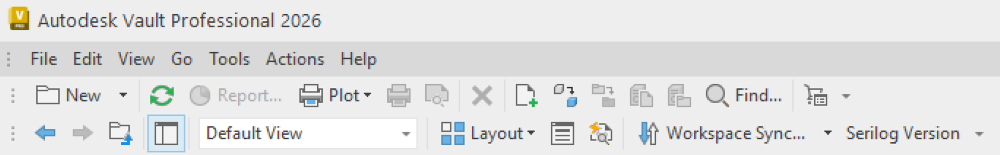
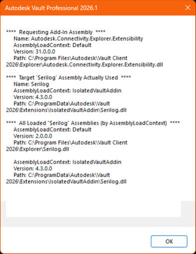

# Isolated Vault Add-in Sample


[](https://dotnet.microsoft.com/en-us/download/dotnet/6.0)
[](https://opensource.org/licenses/MIT)

A minimal Autodesk Vault add-in sample that demonstrates safe dependency isolation. Vault ships with specific assembly versions. Referencing newer (or different) versions in an add-in often causes binding conflicts. This sample allows the use of NuGet package/assembly versions that differ from the ones bundled with Vault by isolating the add-in’s dependencies in a custom load context.




## Setup

### Run Locally

1. Clone this project or download it. It's recommended to install [GitHub Desktop](https://desktop.github.com/). To clone it via command line, use the following:
```
git clone https://github.com/tylerwarner33/autodesk-vault-assembly-load-context.git
```
2. Choose a configuration: `Debug-2026`, `Debug-2025`, `Debug-2024`, `Debug-2023` (or the corresponding `Release-*`) to work with that Vault version.
3. Build the solution. The post-build step creates a bundle and copies it to (replace `<version>` and paste in file explorer):
   - `%ProgramData%\Autodesk\Vault <version>\Extensions\IsolatedVaultAddin\`
4. Run the solution (Vault will launch automatically using the selected version, as configured in the project file).
5. Use the `Serilog Version` button to display the version/context of the loaded Serilog assembly.

### How It Works

- `VaultExplorerExtension.cs`
  - __The main entry point for the `IExplorerExtension` add-in using the `OnStartup()`, `OnShutdown()`, `OnLogOn()`, `OnLogOff()`, `CommandSites()`, `CustomEntityHandlers()`, `DetailTabs()`, `DockPanels()`,  and `HiddenCommands()` methods. Custom add-in logic added here.__
  - Inherits `Isolation/IsolatedIExplorerExtension.cs` which implements `Autodesk.Connectivity.Explorer.Extensibility.IExplorerExtension`.
- `VaultEventHandlerExtension.cs`
  - __The main entry point for the `IWebServiceExtension` add-in using the `OnLoad()` method. Custom add-in logic added here.__
  - Inherits `Isolation/IsolatedIWebServiceExtension.cs` which implements `Autodesk.Connectivity.WebServices.IWebServiceExtension`.
- `VaultJobProcessorExtension.cs`
  - __The main entry point for the `IJobHandler` add-in using the `CanProcess()`, `Execute()`, `OnJobProcessorStartup()`, `OnJobProcessorShutdown()`, `OnJobProcessorSleep()`, and `OnJobProcessorWake()` methods. Custom add-in logic added here.__
  - Inherits `Isolation/IsolatedIJobHandler.cs` which implements `Autodesk.Connectivity.JobProcessor.Extensibility.IJobHandler`.
- .NET 8 / Vault 2026+:
  - `Isolation/AddinLoadContext.cs` defines a dedicated `AssemblyLoadContext` and uses `AssemblyDependencyResolver` so the add-in resolves managed and native dependencies from its own output folder first.
- .NET Framework 4.8 / Vault 2023–2025:
  - The add-in runs in the default `AppDomain`. The sample still reports assembly identity to compare behavior across targets.
- The Vault assemblies are referenced with `<Private>False</Private>` so they always loaded from Vault, while the NuGet dependencies (ex. `Serilog`) are copied beside the add-in and loaded in isolation.
- The `Serilog Version` button (`SerilogPackageVersionCommandItem`) shows the loaded Serilog version and the load context/app domain to verify isolation.
- The project uses MSBuild logic to pick the Vault version and target framework based on the build configuration.

## Resources

- TylerWarner.dev Blog Post: [Isolate Vault Add-In](https://tylerwarner.dev/how-to-use-assemblyloadcontext-for-isolating-inventor-addin-dependencies)
- Microsoft Learn: [System.Runtime.Loader.AssemblyLoadContext](https://learn.microsoft.com/en-us/dotnet/core/dependency-loading/understanding-assemblyloadcontext)
- Microsoft GitHub: [AssemblyLoadContext](https://github.com/dotnet/coreclr/blob/v2.1.0/Documentation/design-docs/assemblyloadcontext.md)

## License

This sample is licensed under the terms of the [MIT License](http://opensource.org/licenses/MIT).
Please see the [LICENSE](LICENSE) file for more details.
